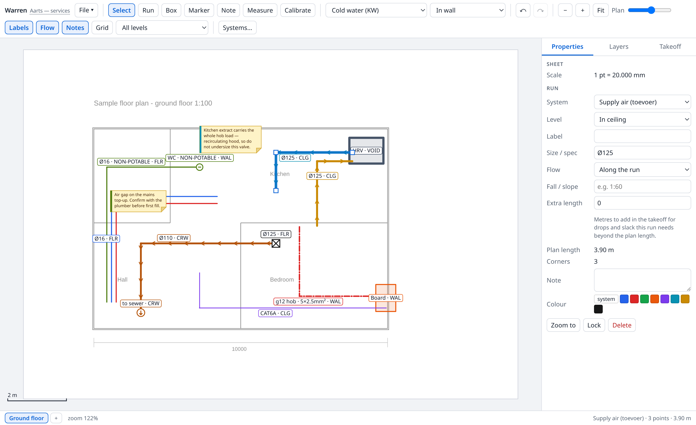

# Warren

*a maze of burrows and passages*

Draw pipes, ducts and circuits on top of your architect's floor plan PDFs.

A small, local, offline drawing tool for planning the services in a house build: fresh water,
rainwater reuse, drainage, heat pump, ventilation, power and data. It is deliberately not CAD —
it is a marked-up plan you can hand to an installer, and a material takeoff you can order from.



## Run it

```bash
npm install
npm run dev          # opens http://localhost:5173
```

Then `File → Import PDF page → this sheet`, pick a page, and calibrate.
There is a sample plan in `samples/sample-floorplan.pdf` if you want to try it before touching
your real drawings — its printed `10000` dimension calibrates to exactly 20 mm per point.

Other scripts:

```bash
npm run check        # typecheck
npm test             # unit tests (node --test, no framework)
npm run test:browser # end-to-end: drives the real app in headless Chromium
npm run build        # static site in dist/ - open it with any web server
```

`test:browser` starts the dev server itself and needs a Chromium binary; set `CHROME_PATH` if
it cannot find one. It covers what unit tests cannot: PDF rendering, canvas hit-testing,
pointer drags, calibration, IndexedDB autosave, PNG export and the print view.

Chrome or Edge give you real in-place saving (File System Access API), but only on a secure
origin — `http://localhost` counts, a LAN address like `http://192.168.1.20:5173` does not.
Firefox has no such API at all. Where it is missing, Save downloads a fresh copy each time and
the File menu tells you which of the two cases you are in.

## The two ideas that shape everything

**Style belongs to the system, not to the shape.** You pick "Cold water" or "400V 3-phase" and
the colour, dash pattern, line width and default size come with it. That is why a drawing made
over two years still agrees with itself, why the legend is trustworthy, and why the takeoff can
add anything up. Per-shape colour override exists, but you should rarely need it.

**A run is one object.** A duct with four corners is a single polyline, not four line segments.
Click any part of it and you select the whole thing; drag it and every corner moves together.

## Working with it

| | |
|---|---|
| **Draw a run** | `L`, then click each corner. `Enter` or double-click finishes, `Backspace` removes the last corner, `Esc` cancels. Hold `Shift` for 45° lock |
| **Select** | `V`. Click a run to select all of it. Shift-click to add. Drag on empty space for a rubber band |
| **Move** | Drag the selection. Arrow keys nudge (`Shift` = 10×) |
| **Edit corners** | Drag a corner handle to move it. `Alt`+click a segment to insert a corner, `Alt`+click a corner to remove it. Double-click a segment also inserts |
| **Equipment** | `R` draws a box — HRV unit, manifold, distribution board |
| **Markers** | `M` places a riser, drain, cleanout or penetration |
| **Notes** | `N` drops a sticky note. Type into Properties; drag the bottom-right handle for width, the height follows the text |
| **Measure** | `D` |
| **Calibrate** | `K`, then click the two ends of a dimension printed on the plan and type its real length in mm |
| **Pan / zoom** | Space-drag or middle-drag to pan, wheel to zoom, `F` to fit |
| **Undo** | `Ctrl+Z` / `Ctrl+Shift+Z`, 100 deep |
| **Save** | `Ctrl+S`, or `Ctrl+Shift+S` for Save as… |
| **Rename** | Click the project title in the toolbar |

## Calibrate first

Nothing measures anything until you calibrate the sheet. Click `K`, click the two ends of a
dimension **printed on the plan**, and type its real length. Use a printed dimension rather than
the stated scale: PDFs are routinely scaled to fit paper, so "1:100" in the title block is often
a lie by a few percent.

After that you get live lengths while drawing, a length per run, a scale bar, and the Takeoff
tab.

## Layers and levels — two different things

**Layers** are the systems, grouped into disciplines. Toggle a whole discipline or a single
system; hidden systems are also unclickable and excluded from exports and prints. The padlock in
the Layers tab freezes a whole system: still visible and still printed, but no longer in the way
of your cursor. The Lock button in Properties does the same for one item.

Locked things cannot be clicked — that is the point — so there are two ways back: hovering one
says so in the status bar, and Properties grows an **Unlock all (n)** button whenever the sheet
has any.

**Level** is where something sits in the building fabric: crawl space, in floor, on floor, in
wall, on wall, in ceiling, above ceiling, roof. It is a property of each item, not a layer, and
the toolbar filter shows one level at a time. A top-down plan cannot show height, so without
this a busy drawing is unreadable — the duct at ceiling level and the pipe in the screed cross
on paper and never touch in reality.

The `in` / `on` pairs carry two different facts. Runs are buried *in* something; equipment is
mounted *on* something — the board hangs on a wall, the cylinder and the rainwater pump stand
on the floor. Surface-run conduit in a garage uses "on wall" too.

## Notes

`N` drops a yellow sticky anywhere on the plan — "air gap on the mains top-up, confirm before
first fill", the kind of thing you will not remember in eight months.

A note belongs to a system like everything else, and the coloured stripe down its left edge
tells you which. Hide ventilation and the notes about ventilation go with it. Notes that belong
to no discipline can use **General note** in the structure group.

The **Notes** button in the toolbar hides all of them at once, for a clean print. Hidden notes
are unclickable as well as invisible, so you cannot drag one you cannot see. Notes never appear
in the takeoff — they are annotations, not material.

## The takeoff

The Takeoff tab totals metres per system, for the sheet or the whole project.

A plan length is not a material length: drops down walls, rises into ceilings, bends and service
loops are all invisible from above. The **slack %** (default 10) covers that globally; the
per-run **extra length** field covers a specific run that needs more. Order from the right-hand
column.

## Saving

**Name the project first.** Click the title next to "Warren" in the toolbar (or File → Rename
project…). That name is the print heading and the suggested file name, and Save as… on a still
-untitled project adopts whatever file name you type.

Your project is a single `*.warren.json` file with the source PDF embedded, so it is
self-contained: back it up, mail it, put it in git. The JSON is formatted and diffs cleanly,
which makes `git log` a decent history of how the design changed over the build.

```bash
git init && git add my-house.warren.json && git commit -m "services, first pass"
```

There is also a 30-second autosave to IndexedDB, but that is a **crash net, not a save**.
Browser storage gets cleared by updates and cleanup tools, and does not follow you to another
machine. Save to a file.

## Printing

`File → Print / PDF…` renders the sheet, adds a legend of only the systems actually drawn plus
the takeoff table, and opens the browser print dialog — choose "Save as PDF".

Untick disciplines first to produce a sheet per trade. The electrician does not need your drain
falls.

## What it deliberately does not do

No 3D, no isometrics, no pipe sizing or load calculation, no DWG, no collaboration, no cloud.
Those are what makes real MEP software cost real money and take real training. This stays a
drawing you can read.

## Layout

```
src/
  geom.ts          pure geometry (distances, ortho snap, polyline walking)
  takeoff.ts       metres per system
  units.ts         metric formatting
  model/           types, the systems catalogue, the document store + undo
  io/              pdf.js import, project file, autosave, PNG export, print
  render/          camera, background raster cache, the scene painter
  interact/        hit testing, snapping, the pointer/tool state machine
  ui/              toolbar, side panel, dialogs
docs/systems-checklist.md   what to draw, and what people forget
```

Three runtime dependencies: `vite`, `typescript`, `pdfjs-dist`. That is on purpose — this has to
still open in five years.
